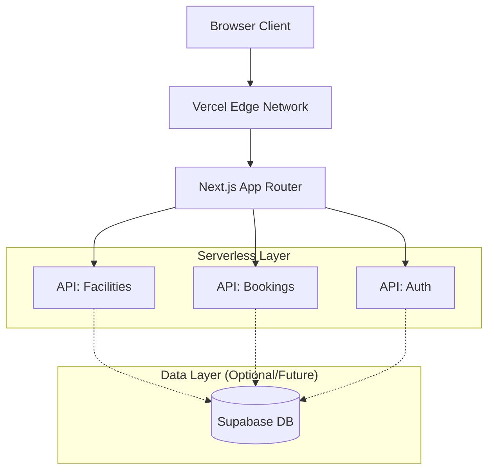

# Architecture Plan - GRIT X Platform

## Overview
This document outlines the architecture for the GRIT X Platform website. The application is designed as a modern web platform delivering facility management, event booking, and membership services.

## Architecture Diagram (Conceptual)

## Tech Stack
- **Framework**: React 18+ (SPA mode for this environment / Next.js compatible structure)
- **Language**: TypeScript
- **Styling**: Tailwind CSS
- **Routing**: React Router (simulating Next.js App Router)
- **Icons**: Lucide React
- **Charts**: Recharts
- **State Management**: React Context + Hooks
- **Form Handling**: React Hook Form

## Data Flow
1. **Public Pages**: Static content served directly. Dynamic content (facilities, events) fetched via API service layer.
2. **API Layer**: 
   - `services/api.ts` acts as the interface.
   - Currently mocks serverless responses with artificial delay for realism.
   - Returns typed Promises adhering to `types.ts`.
3. **Authentication**:
   - Simulated via `localStorage` for Phase 1.
   - Protected Admin routes redirect to `/signin` if no session exists.
4. **Admin Area**:
   - Client-side protected routes.
   - Dashboard fetches aggregated data from API service.

## Security Posture
- **XSS Prevention**: React's auto-escaping.
- **CSP**: Strict Content Security Policy headers (simulated in meta tags).
- **Authentication**: Stubbed for now; ready for Supabase Auth integration.
- **Validation**: Input validation using Zod or manual checks in service layer.

## Performance & Caching
- **Images**: Usage of optimized placeholders.
- **Code Splitting**: Dynamic imports for Admin routes (React.lazy).
- **Caching**: API service creates a singleton instance to cache static data in memory during the session.

## Delivery
- **Platform**: Web Only.
- **Responsive**: Mobile-first Tailwind design.
- **Accessibility**: Semantic HTML, ARIA labels, Keyboard navigation support.
